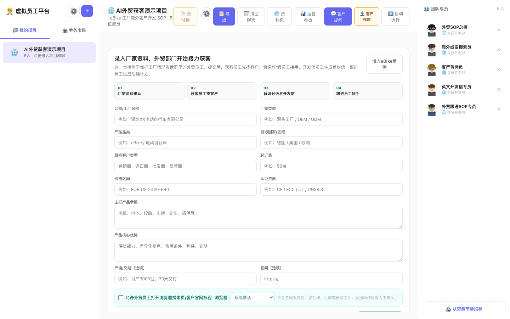
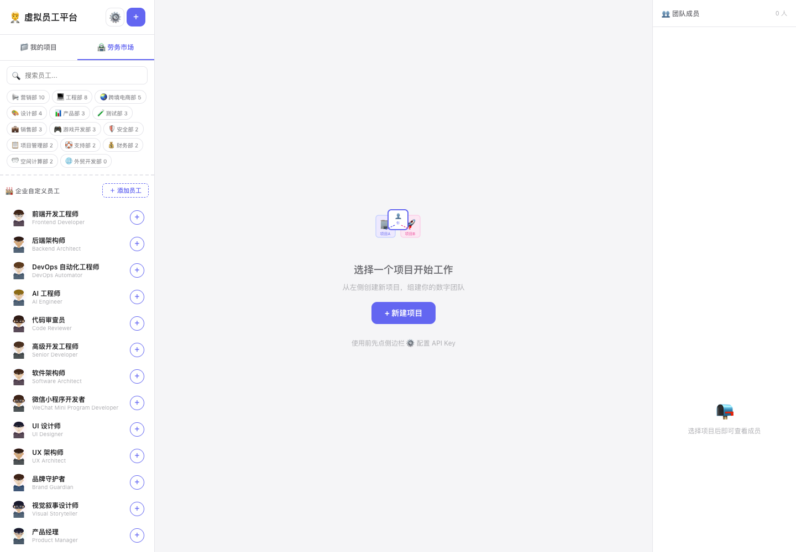
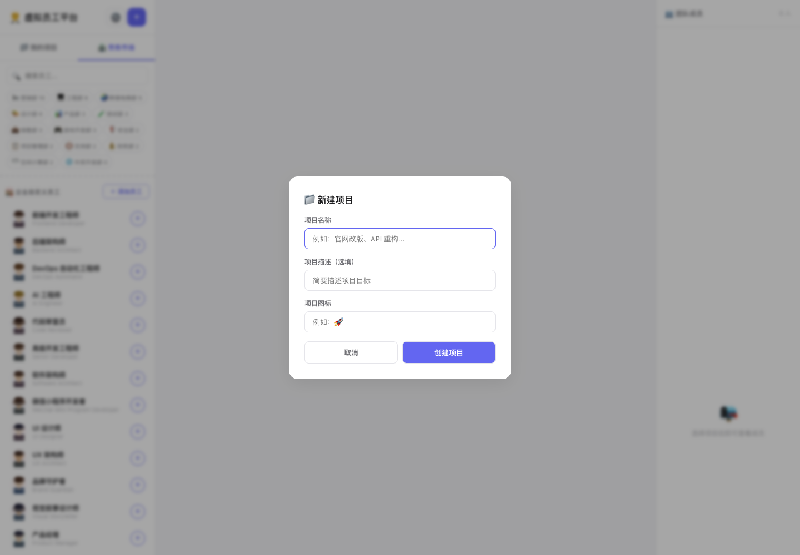
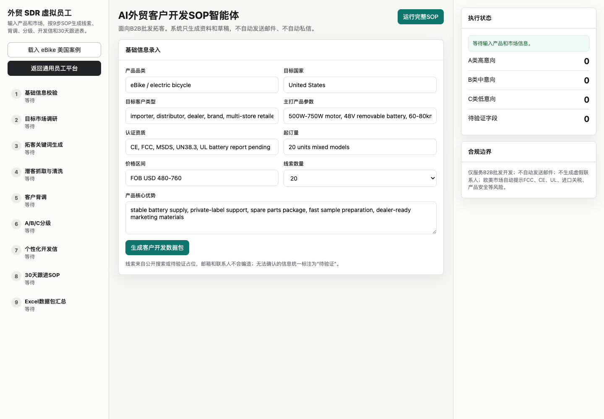

# 虚拟员工平台 · Virtual Employee Platform

> Commercial use: this repository is published for portfolio/demo evaluation. Commercial use or resale requires written permission. See `COMMERCIAL_USE.md`.

## Screenshots

**Virtual employee workspace**



**Labor market and agent library**



**Project creation modal**



**eBike example loaded**



一个人 + AI = 一家完整公司。智播营销咨询(9人) | 天猫全域电商(6人) | Amazon跨境(4人) | Shopify独立站(2人) | TikTok内容电商(4人) | B2B外贸(4人) | AI外贸获客小队(5人)

---

## 快速启动

```bash
# 一键启动本地 API + 前端页面
./start.sh
```

启动后终端会打印页面地址，例如：

```text
http://127.0.0.1:9101/agency-workspace.html?agent_port=9100
```

默认打开原来的 `虚拟员工平台`。服务端只使用 Python 标准库，不需要安装 Flask。

如果双击启动，在 macOS 上可双击 `start.command`。

更直观的双击入口：

```text
一键启动.command
```

双击后会同时启动智能体 API 和前端页面，并自动打开虚拟员工平台。窗口不要关，按 `Ctrl+C` 可停止服务。

## 平台内外贸模块

外贸模块不是独立应用，而是虚拟员工平台里的一个团队模板：`AI外贸获客小队`。

第一版不需要把每个步骤都做成一个人。外贸获客更适合5人小队：主管定ICP和边界，获客员工找客户，客户研究员工做背调评分，开发内容员工写开发信/社媒内容，跟进交付员工接手跟进和导出。

使用路径：

1. `./start.sh` 启动平台
2. 新建项目
3. 选择 `AI外贸获客小队`
4. 在群聊里填写厂家资料
5. 点击 `启动外贸获客流程`

流程会自动出现这些员工交接：

- 外贸SOP总控：确认厂家资料、ICP客户画像、市场边界和合规风险
- 海外线索搜索员：生成搜索词、找客户、过滤C端和低质量线索
- 客户背调员：读取官网、客户画像、采购潜力和A/B/C评分
- 英文开发信专员：生成开发信、LinkedIn私信、社媒获客内容
- 外贸跟进SOP专员：生成30天跟进计划、人工确认提醒和Excel交付包

这个团队包含5个可执行任务的外贸员工。市场调研、关键词、清洗、分级、合规、导出不再作为单独员工刷屏，而是归入对应员工的 `调用工具记录`：

| 员工 | 职责 |
|---|---|
| 外贸SOP总控 | ICP、市场判断、流程节奏、风险边界 |
| 海外线索搜索员 | 搜索词、公开来源获客、线索过滤 |
| 客户背调员 | 官网读取、企业画像、A/B/C评分 |
| 英文开发信专员 | 开发信、私信、社媒获客内容 |
| 外贸跟进SOP专员 | 30天跟进、人工确认、Excel导出 |

右上角 `🌐 资料包` 仍保留为批量资料包工具，可以一次性生成完整Excel，但不是主要工作流。主工作流是在群聊里完成厂家资料录入和员工接力。

批量资料包会执行：

1. 基础信息校验
2. 目标市场调研
3. Google/LinkedIn 拓客关键词生成
4. 海外 B 端客户线索抓取与清洗
5. 客户官网背调与画像
6. A/B/C 意向分级
7. 三套英文开发信生成
8. 30 天 7 次跟进计划
9. Excel 数据包导出

接口：

```text
POST /foreign-trade/validate
POST /foreign-trade/dispatch
POST /foreign-trade/workflow/start
POST /foreign-trade/run
GET  /foreign-trade/export/{run_id}
```

内置 eBike 美国市场示例，可一键测试完整流程。所有线索、邮箱、联系人无法确认时标记为“待验证”，不会编造客户资料；系统只生成草稿和计划，不自动发送邮件。

`foreign-trade-workspace.html` 仍保留为调试页，正式使用建议从 `agency-workspace.html` 平台内进入。

每一个虚拟员工都会作为独立 Agent 运行：

- 独立角色身份和 SQLite 记忆
- 多轮工具调用循环
- 可读取/保存项目文件
- 可抓取网页、打开浏览器、打开搜索结果
- 可执行 Shell 命令
- 可通过 macOS AppleScript 打开应用、输入文字、按快捷键、点击坐标

电脑操作能力默认开启。如果需要让 Agent 点击、输入或控制应用，请在 macOS「系统设置 → 隐私与安全性 → 辅助功能」里给终端或 Codex 权限。

可以用环境变量关闭高权限工具：

```bash
AGENT_ENABLE_SHELL=0 ./start.sh
AGENT_ENABLE_COMPUTER=0 ./start.sh
AGENT_ENABLE_BROWSER=0 ./start.sh
```

启动后可访问 `GET /tools` 查看当前启用的工具。

AI外贸获客小队也接入了工具能力：

- 5个核心员工会在群聊气泡里显示 `调用工具记录`
- 默认会用本地后端做网页搜索、网页读取、线索清洗、评分、Excel导出
- 在厂家资料表单勾选 `允许外贸员工打开浏览器搜索页/客户官网核验` 后，获客员工会调用浏览器打开搜索页或客户官网
- 不会自动发邮件、发社媒、付款、删除文件或对外发布内容；开发信和跟进消息仍然必须人工确认后发送

---

## 团队模板

| 场景 | 人数 | 适用 |
|---|---|---|
| 🎯 智播营销咨询 | 8人+1客户 | 教练式操盘，内部对抗辩论后出正式方案书 |
| 🛒 天猫全域电商 | 6人 | 运营/视觉/文案/拍摄/投流/客服私域 |
| 📦 Amazon 卖家 | 4人 | Listing+PPC+供应链+合规 |
| 🏪 Shopify DTC | 2人 | 品牌增长+运营自动化，需配 Sidekick |
| 🎵 TikTok 内容电商 | 4人 | 短视频+直播+达人+投流 |
| 🌐 B2B 外贸 | 4人 | 阿里国际站询盘+运营+跟单+营销 |
| 🌐 AI外贸获客小队 | 5人 | 你说任务，系统自动派主管/获客/背调评分/开发内容/跟进交付员工 |

---

## 三种工作模式

**群聊协作** — 选团队模板 → 发指令 → 6阶段诊断/方案/对线/裁决/分工/文档汇总
**客户提问** — 「💬 客户提问」→ 客户提交问题 → 后台对抗辩论 → 交付正式方案书
**运营看板** — 「📊 运营看板」→ 选平台 → 「🔄 立即巡检」→ AI生成巡检报告+告警

---

## Shopify 直连接入

1. 编辑 shopify_config.json，填入店铺信息
2. 重启 agent-server.py
3. Shopify Agent 可直接读写产品/订单/库存

---

## 需要 DeepSeek API Key

注册地址：platform.deepseek.com
密钥仅保存在浏览器 localStorage，不经过任何服务器。

## Private Deployment / Customization

For private deployment, custom AI employee teams, foreign-trade workflow customization, or business automation consulting, scan WeChat to contact me.


